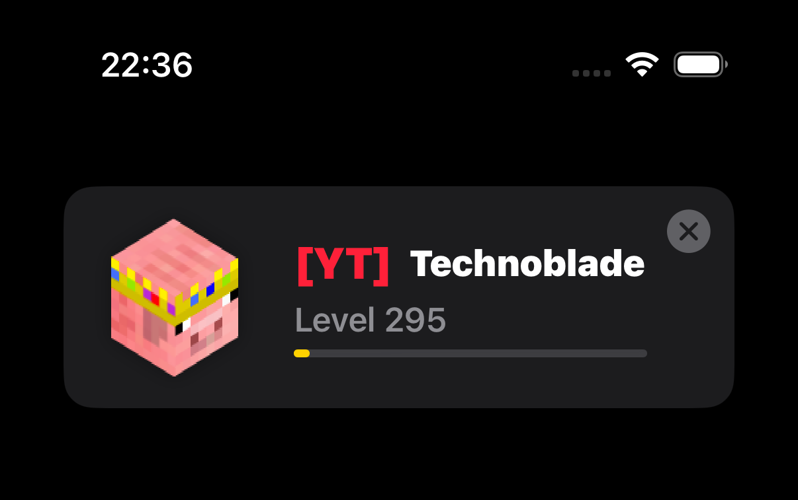
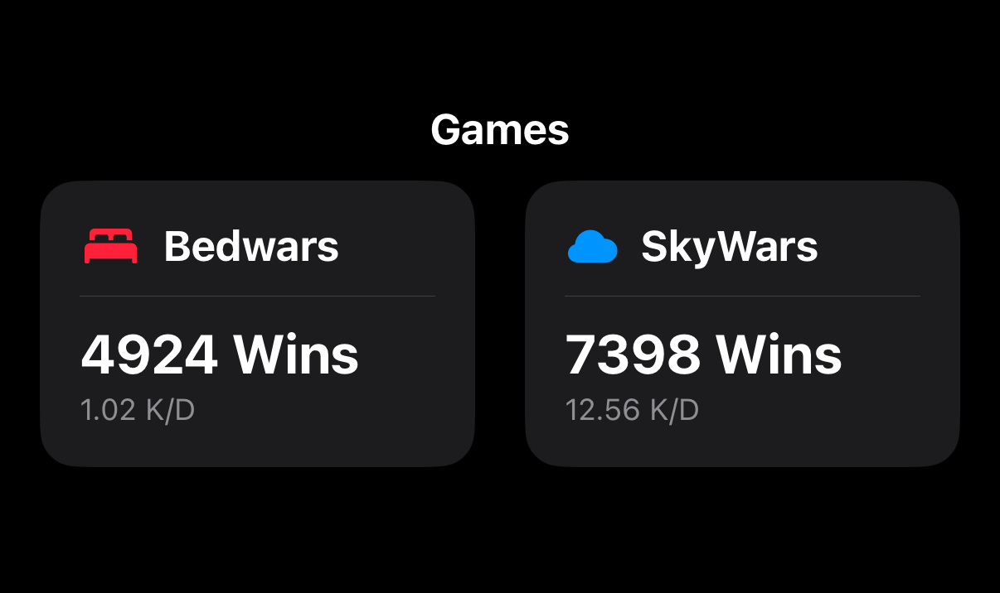

<div align="center">


</div>

> ⚠️ **Educational Project Notice**
>
> HyTracker is a **playground project** created to explore the Swift ecosystem.
>
> **API Key Required:** This app relies on the Hypixel API. You must provide your own API Key in the code to fetch stats.

**HyTracker** brings your Hypixel stats to your pocket. It connects Mojang and Hypixel APIs to deliver a clean, native dashboard experience, featuring 3D avatars, real-time rank detection, and detailed game statistics.

---

## 🛠 How to Install & Build

1.  **Clone** the repository (use the `develop` branch for the latest features).
    ```bash
    git clone -b develop https://github.com/YOUR_USERNAME/HyTracker.git
    ```
2.  Open `HyTracker.xcodeproj` in **Xcode 26+**.
3.  **Important:** Navigate to `HypixelAPI.swift` and locate the `apiKey` variable.
4.  Replace the placeholder with your own key from `developer.hypixel.net`.
    ```swift
    static let apiKey: String = "YOUR-UUID-KEY-HERE"
    ```
5.  Run the app on a Simulator or real iPhone.

---

## 📱 Showcase

HyTracker provides a fluid, native iOS interface.

| Feature | Description |
| :--- | :--- |
|  | **Smart Search & History**: Enter a username to fetch their UUID via Mojang. Recent searches are automatically saved locally using **SwiftData** for instant access later. |
|  | **Visual Dashboard**: Displays the player's 3D head (via Crafatar), their real-time **Hypixel Rank** (VIP, MVP++, etc.) with correct color codes, and their Network Level progress. |
|  | **Game Statistics**: A responsive grid layout showing deep stats for **Bedwars** and **SkyWars**. Includes calculated metrics like **K/D Ratio** and Win counts. |

---

## ⚡ Current Features (Preview)

This project is currently in **early preview**. The core foundation is built, featuring:

*   **Smart Search**: Enter a username to fetch their UUID via Mojang API.
*   **Local History**: Recent searches are automatically saved and sorted locally using **SwiftData**.
*   **Player Dashboard**: Displays 3D avatars (Crafatar), real-time Ranks (VIP, MVP++, etc.), and Network Level.
*   **Game Data**: A grid layout showing key statistics for **Bedwars** and **SkyWars** (Wins, K/D Ratio, etc.).

> 🚧 **Work in Progress**
>
> **A lot more is coming in the coming days!** This is just a preview version to demonstrate the core architecture and API implementation.

---

## 🤝 Contributing

This is an open learning journey. If you are experienced with Swift/SwiftUI and see room for improvement, or if you just have some cool tweaks to add, **feel free to fork this repository or submit a Pull Request!** All contributions are welcome.

---

*Built with ❤️ and blocks.*
